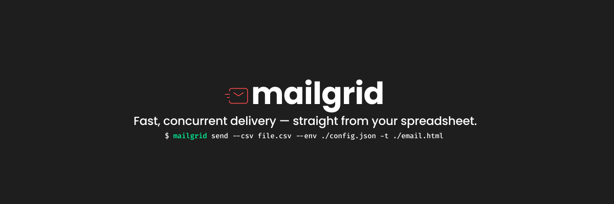

<div align="center">
  
</div>

<p align="center">
  <a href="https://pkg.go.dev/github.com/bravo1goingdark/mailgrid">
    
  </a>
  <a href="https://goreportcard.com/report/github.com/bravo1goingdark/mailgrid">
    
  </a>
  <a href="https://github.com/bravo1goingdark/mailgrid/actions/workflows/go.yml">
    
  </a>
  <a href="https://github.com/bravo1goingdark/mailgrid/releases/latest">
    
  </a>
  <a href="https://github.com/bravo1goingdark/mailgrid/blob/main/LICENSE">
    
  </a>
</p>

# Mailgrid

Production-ready CLI for bulk email campaigns via SMTP. Reads recipients from CSV or Google Sheets, renders personalized HTML templates, and delivers at scale with parallel workers, retries, resumable delivery, real-time monitoring, scheduling, and webhook notifications.

---

## Install

```bash
go install github.com/bravo1goingdark/mailgrid/cmd/mailgrid@latest
```

Or download a pre-built binary from [Releases](https://github.com/bravo1goingdark/mailgrid/releases/latest).

**Build from source:**

```bash
git clone https://github.com/bravo1goingdark/mailgrid.git
cd mailgrid
make build
```

---

## Quick Start

```bash
# 1. Create SMTP config
cat > config.json <<'EOF'
{
  "smtp": {
    "host": "smtp.gmail.com",
    "port": 587,
    "username": "you@gmail.com",
    "password": "your-app-password",
    "from": "You <you@gmail.com>"
  }
}
EOF

# 2. Send a single email
mailgrid --env config.json --to user@example.com --subject "Hello" --text "Hi!"

# 3. Bulk send from CSV
mailgrid --env config.json --csv recipients.csv --template email.html --subject "Hi {{.name}}!"

# 4. Bulk send with live dashboard
mailgrid --env config.json --csv recipients.csv --template email.html \
  --concurrency 5 --monitor
```

---

## Features

| Feature | Description |
|---|---|
| CSV & Google Sheets | Recipients from CSV files or public Google Sheets (SSRF-protected) |
| HTML Templates | Personalized emails with Go `text/template` syntax |
| Multipart Emails | `multipart/alternative` with HTML + plain-text when both are provided |
| Concurrency | Parallel SMTP workers with configurable batch size |
| Retries & Backoff | Per-email retry with capped exponential backoff + jitter |
| Resumable Delivery | Interrupted campaigns pick up exactly where they left off |
| Scheduling | One-time, interval, or cron-based jobs (BoltDB-backed, distributed lock) |
| Monitoring | Real-time SSE dashboard — progress, EPS, per-recipient status |
| Prometheus Metrics | `/metrics` endpoint compatible with Prometheus scrapers |
| Recipient Filtering | Expression-based filtering (`==`, `contains`, `startsWith`, …) |
| Deduplication | Duplicate emails in CSV are removed before sending |
| Webhooks | HTTP POST on campaign completion, optionally HMAC-SHA256 signed |
| Attachments | File attachments with MIME detection, up to 10 MB |
| CC / BCC | Carbon copy and blind carbon copy with envelope deduplication |
| Auto-Reconnect | Transparent SMTP reconnection on connection drop |
| Structured Logging | logrus-backed, `--log-level` and `--log-format json` support |
| Dry Run & Preview | Render and inspect emails without sending |
| Graceful Shutdown | Clean exit on SIGINT / SIGTERM |
| Config Validation | SMTP fields validated at startup before any work begins |

---

## Common Workflows

### Bulk send with filtering and monitoring

```bash
mailgrid --env config.json \
  --csv recipients.csv \
  --template email.html \
  --subject "Hi {{.name}}!" \
  --filter 'tier == "premium" && country == "US"' \
  --concurrency 5 --retries 3 \
  --monitor
```

### Multipart email (HTML + plain-text fallback)

```bash
mailgrid --env config.json --csv recipients.csv \
  --template email.html --text fallback.txt \
  --subject "Your newsletter"
```

### Resume an interrupted campaign

```bash
mailgrid --env config.json --csv recipients.csv --template email.html --resume
```

### Schedule a recurring send

```bash
mailgrid --env config.json --csv recipients.csv --template email.html \
  --cron "0 9 * * 1-5" --subject "Daily digest"
```

### Webhook with HMAC signing

```bash
mailgrid --env config.json --csv recipients.csv --template email.html \
  --webhook "https://hooks.example.com/mailgrid" \
  --webhook-secret "my-secret"
```

### JSON logs for aggregation pipelines

```bash
mailgrid --env config.json --csv recipients.csv --template email.html \
  --log-level info --log-format json 2>> mailgrid.log
```

---

## Documentation

| Document | Contents |
|---|---|
| [docs/docs.md](./docs/docs.md) | Complete flag reference, SMTP config, TLS, delivery logs, exit codes, operational runbook, provider configs |
| [docs/filter.md](./docs/filter.md) | Filter expression syntax, all operators, 30+ examples by use case, testing tips |

---

## Security

- **Input validation** — CC/BCC file paths are restricted to the working directory. Google Sheets URLs are validated against `docs.google.com`; arbitrary URLs and open redirects are rejected.
- **TLS** — TLS 1.2+ enforced. `insecure_tls: true` emits a warning. Misconfigured cert paths are a hard error, not a silent fallback.
- **Webhooks** — use `--webhook-secret` for HMAC-SHA256 request signing (`X-Mailgrid-Signature` header, GitHub-compatible).
- **Monitor server** — binds to `127.0.0.1` only, no wildcard CORS, max 50 SSE connections.

---

## Project Structure

```
mailgrid/
├── cmd/mailgrid/        # Entry point
├── cli/                 # Flag parsing, run orchestration, task preparation
├── config/              # SMTP config loading and validation
├── database/            # BoltDB job persistence
├── email/               # SMTP client, dispatcher, worker pool, sender
├── internal/types/      # Shared types (Job, CLIArgs)
├── logger/              # logrus-backed structured logging
├── monitor/             # HTTP dashboard, SSE broadcast, /metrics endpoint
├── offset/              # Resumable delivery offset tracking
├── parser/              # CSV parsing, expression evaluation, filtering
├── scheduler/           # Cron/interval job scheduling, distributed lock
├── utils/               # Template rendering, address parsing, helpers
├── webhook/             # Webhook notifications with HMAC signing
├── test/                # Integration and unit tests
└── docs/                # Documentation
```

---

## CI / CD

Every push runs four parallel jobs:

| Job | What it checks |
|---|---|
| `test` | `go vet`, `gofmt`, unit tests, race detector, coverage |
| `lint` | `golangci-lint` (errcheck, staticcheck, unused, misspell, …) |
| `security` | `gosec` static security analysis |
| `cross-compile` | linux/amd64, linux/arm64, darwin/arm64, windows/amd64 |

Run the full gate locally:

```bash
make check    # lint + security + race + test
```

---

## License

BSD-3-Clause — see [LICENSE](./LICENSE).
